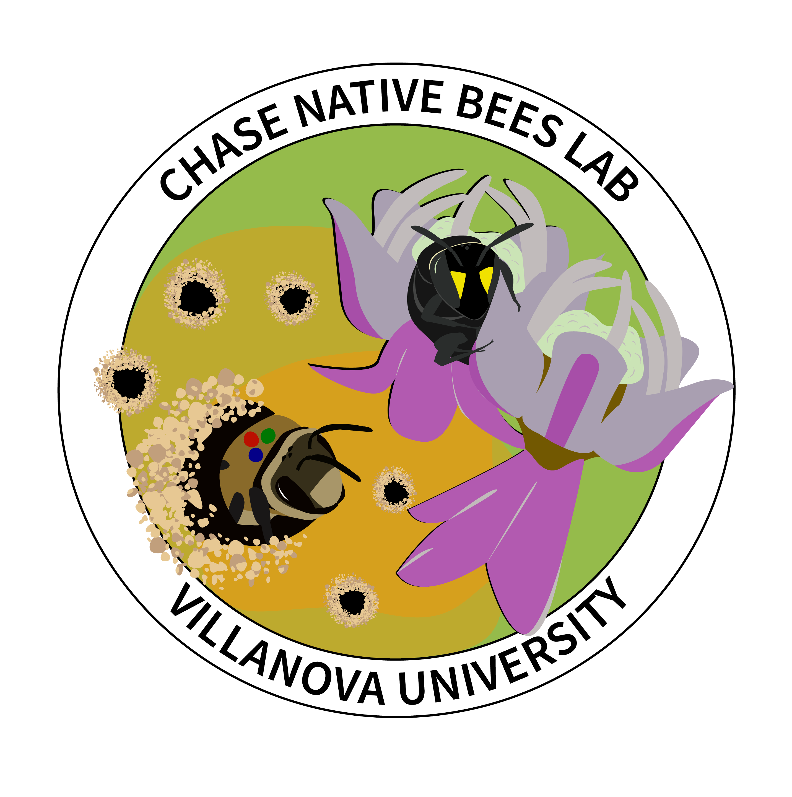

```{=html}
<div class="hero-banner">
  <div class="hero-content">
    
    <div class="hero-banner-text">
      <p class="hero-description">
        Welcome to the Chase Native Bees Lab! We study all things related to wild native bees, with the broad aim of teasing apart their intricate biologies and ecologies in ways that guide their conservation, as well as restoration and management. Our work centers on bee population dynamics, movement and dispersal, nesting, and natural history — including pollination biology studies on plants bees love! We also conduct broad community-level work using rigorous statistical and geospatial analysis.
      </p>
      <p class="hero-cta"><strong>Stay tuned as we get going in fall 2026!</strong></p>
    </div>
  </div>
</div>
<div class="hero-spacer"></div>
```
