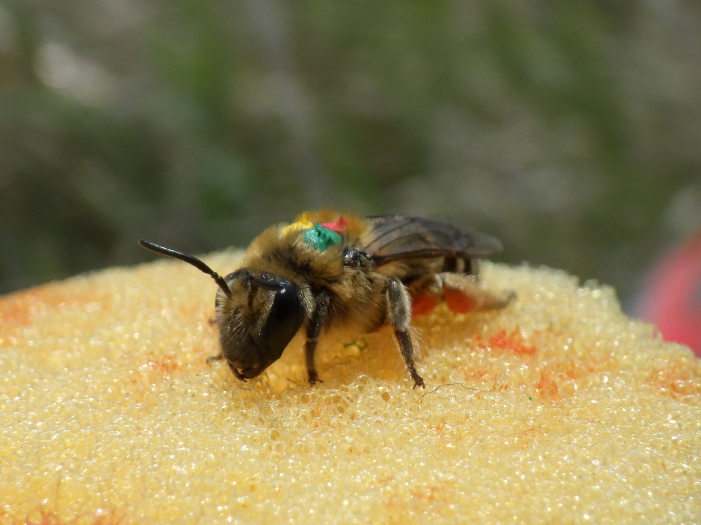
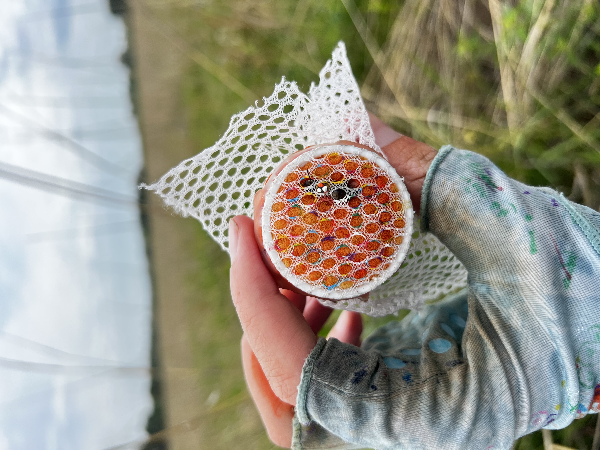
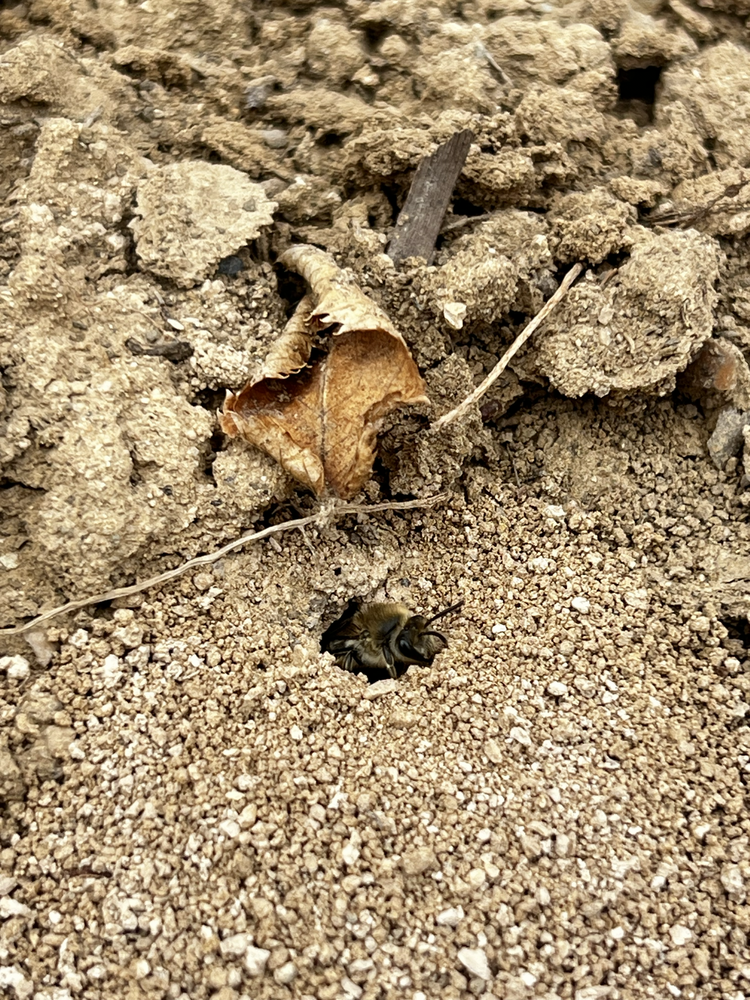
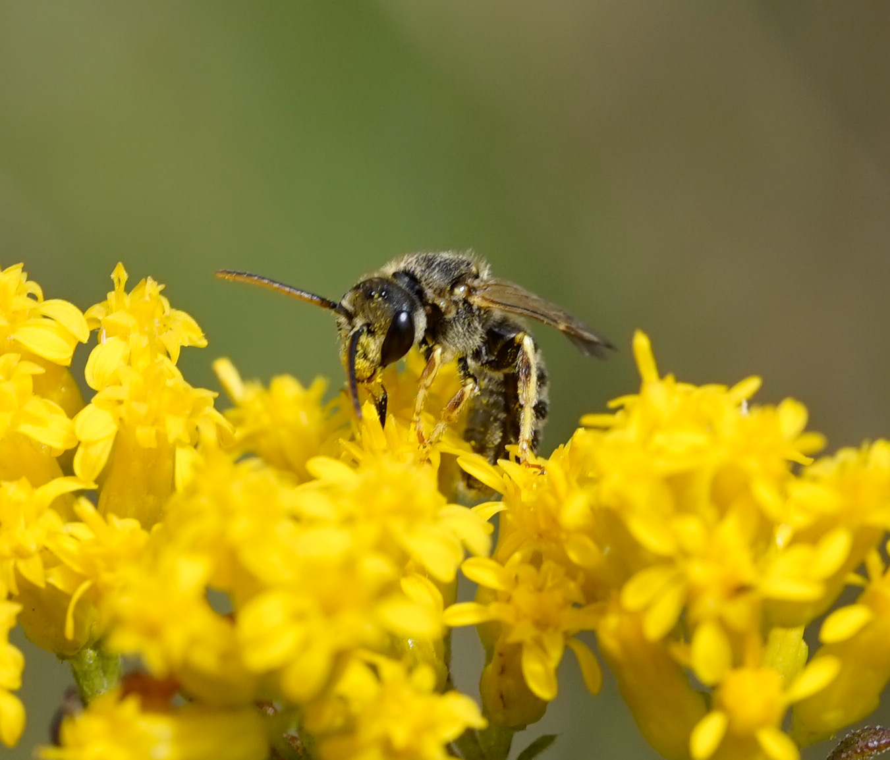
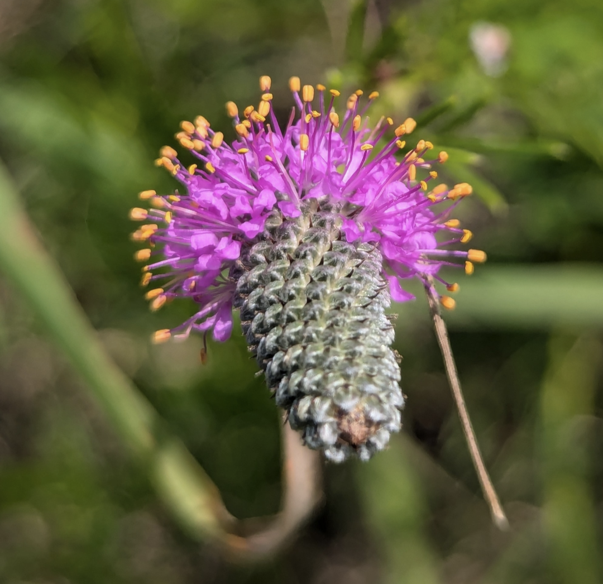

## Bee population dynamics

::::: research-section
::: research-text
Understanding the population dynamics of solitary bee species remains a considerable challenge for the field. Basic questions such as "how big is a population" or "how does population size fluctuate from year to year" are unknown yet critical for conservation and conducting research. Within this research, we also emphasize movement ecology. We investigate the biology of dispersal and foraging across populations and communities and explore which factors affect movement and why.
:::

::: research-images

:::
:::::

## Solitary bee nesting studies

::::: research-section
::: research-text
Research emphasizes increasing floral resource availability to conserve bees, yet we know so little about nesting requirements of solitary bee species, especially our ground-nesting species that encompass roughly 80% of all bee species. We study all things bee nesting, from nest architecture to phenology and nesting as it relates to dispersal and movement. We are also in the process of getting our environmental chamber up and running in the lab and hope to get some bee nesting action in there. Stay tuned!
:::

::: research-images

:::
:::::

## Effectiveness of bee monitoring

::::: research-section
::: research-text
We are interested in exploring different ways to monitor bee communities. Whether this is using non-lethal methods such as mark-release-recapture, targeted surveys, geospatial data, or methods in-between, we want to determine how we can collect data and reduce lethal take.
:::

::: research-images

:::
:::::
